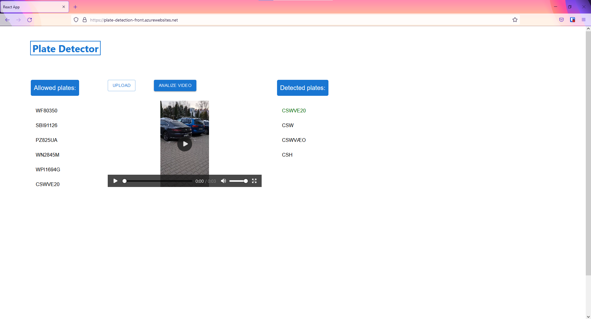

# License plate detection and OCR

## Cel projektu

Celem projektu było stworzenie serwisu do rozpoznawania tablic rejestracyjnych na podstawie filmu (format mp4, długość do 15 sekund) do zastosowania w automatyzacji otwierania bram garażowych, czy monitorowania ruchu w okolicy.

## Skład zespołu

* Michał Gajda - [github](https://github.com/michauga)
* Damian Janczarek - [github](https://github.com/janczarek99)
* Hubert Piłka - [github](https://github.com/MrBallOG)
* Tomasz Stańczuk - [github](https://github.com/TommyV2)

## Stos technologiczny

* React
* Python (FastAPI)
* Docker
* Azure App Service
* Azure Computer Vision (OCR)
* Azure Container Services:
  * Container Instances
  * Container Registry
* Azure Custom Vision (Object Detection)
* Azure Virtual Machines

## Diagram architektury

## Sposób działania

Główną częścią aplikacji są serwisy Custom Vision i Computer Vision. Pierwszy z nich przetwarza klatki filmu w poszukiwaniu tablic rejestracyjnych, korzystając z oferowanej przez Azure detekcji obiektów. W celu wyuczenia modelu wykorzystany został zbiór danych udostępniony na stronie [public.roboflow.com](https://public.roboflow.com/object-detection/license-plates-us-eu). Zdjęcia zostały załadowane do serwisu Custom Vision.

Następnie otagowano na nich rejony, w których znajdują się tablice rejestracyjne i poddano model procesowi trenowania.

Otrzymany w wyniku model został opublikowany w formie API, dostępnego za podaniem klucza. Drugi serwis (Computer Vision) jest gotowym rozwiązaniem, oferującym optyczne rozpoznawanie znaków, więc wystarczyło stworzyć zasób i upublicznić go w formie API (również dostępnego za podaniem klucza).

W celu umożliwienia interakcji z oboma serwisami powstało API napisane w Python'ie przy użyciu framework'a FastAPI. Aplikacja ta otrzymuje filmik, a następnie dzieli go na klatki (10 klatek na 1 sekundę filmu) i wysyła je pojedynczo do serwisu Custom Vision. Każda z odesłanych predykcji poddawana jest procesowi selekcji, z którego wybierane są tylko te rejony z największym prawdopodobieństwem bycia tablicą rejestracyjną (>= 75%). Następnie aplikacja wycina ze zdjęcia wybrane rejony i każdy z nich wysyła do serwisu Computer Vision. Tam obraz jest interpretowany i zwracany jest znaleziony numer rejestracyjny. Po przerobieniu wszystkich obrazów, aplikacja wysyła odpowiedź w formie listy znalezionych tablic. Obecne rozwiązanie nie wspiera dodawania zaufanych tablic rejestracyjnych, są one na sztywno zapisane w pliku konfiguracyjnym [settings.py](backend/src/settings.py). API to w formie kontenera zostało dodane do serwisu Container Registry i tam zbudowane. Następnie przy pomocy serwisu Container Instances aplikacja została wdrożona.

W celu zwiększenia bezpieczeństwa w komunikacji z backend'em, zdecydowano na dodanie pośrednika w formie serwera NGINX działającego na maszynie wirtualnej Ubuntu, jako reverse proxy. Dzięki temu można wysyłać dane kanałem szyfrowanym.

Do interakcji użytkownika z systemem powstała aplikacja webowa napisana w React'cie wdrożona przy pomocy App Service. Interfejs użytkownika jest bardzo prosty, wystarczy dodać lokalny plik (klikając "UPLOAD"), a potem nacisnąć przycisk "ANALIZE VIDEO". Następnie po prawej stronie ekranu wyświetli się lista wykrytych tablic rejestracyjnych.

Link do strony - <https://plate-detection-front.azurewebsites.net/>

## Demo rozwiązania

## Reprodukcja rozwiązania

Poniżej znajdują się przyciski, które służą do szybkiego wdrożenia serwisów użytych do stworzenia aplikacji, przy użyciu szablonów ARM (Azure Resource Manager). Do odtworzenia tej aplikacji wystarczy sklonować to repozytorium i użyć [Dockerfile'a](backend/Dockerfile) do stworzenia kontenera z API. Natomiast do stworzenia frontend'u należy pobrać [pakiety](frontend/package.json) i zbudować aplikację. Dane dla serwisu Custom Vision natomiast są pod tym [linkiem](https://public.roboflow.com/object-detection/license-plates-us-eu).

### App Service

### Computer Vision

### Container Services + Virtual Machines

### Custom Vision

